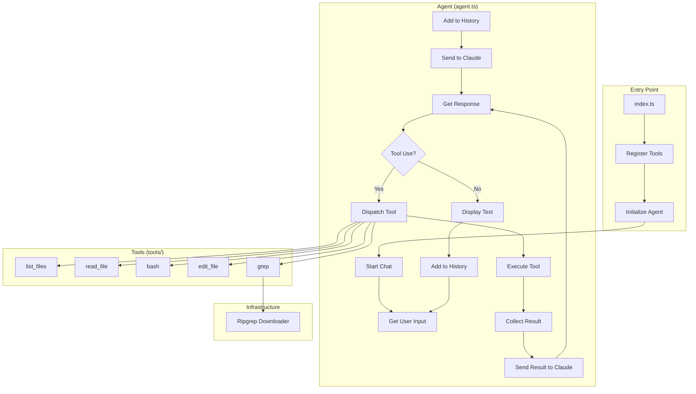

# Chapter 5: Expanding the Toolkit

In this chapter, we extend our agent's capabilities by adding more powerful tools and a more robust infrastructure. We move beyond simple file reading and listing to enable complex environment interactions through shell access, precise file editing, and high-performance searching.

## The Goal

Empower the agent with a "Swiss Army knife" of tools that allow it to not just read the codebase, but actively explore and modify it, while ensuring the tools description remain manageable and the binary dependencies are handled automatically.

## New Features

### 1. Expanded Toolset
We've added three major tools to the agent's arsenal:
- **Bash Tool**: Provides direct shell access to run commands, build projects, and verify changes.
- **Edit File Tool**: Allows for precise, non-destructive file modifications using unique string replacement or global search-and-replace.
- **Grep Tool**: Leverages the power of Ripgrep for ultra-fast, regex-based searching across the entire project.

### 2. Externalized Tool Descriptions
As tools grow in complexity, their descriptions (which are passed to the LLM) become quite large. We've moved these to external `.txt` files in `tools/tool_description/` to keep our TypeScript code clean and maintainable.

### 3. Ripgrep Downloader
To ensure the `grep` tool works on any system without manual configuration, we've implemented a self-contained downloader in `ripgrep/index.ts`. It automatically detects the operating system, downloads the correct Ripgrep binary from GitHub, and extracts it to a local `bin` directory.

## File Structure

```
Chapter5/
├── index.ts              # Entry point - registers all 5 tools
├── agent.ts              # Core Agent class (reusable)
├── types.ts              # Shared interfaces
├── ripgrep/              # Ripgrep downloader and utility
│   └── index.ts
└── tools/
    ├── list_files.ts     # List files tool
    ├── read_file.ts      # Read file tool
    ├── bash_tool.ts      # [NEW] Shell command tool
    ├── edit_tool.ts      # [NEW] File editing tool
    ├── grep.ts           # [NEW] High-performance search tool
    └── tool_description/ # [NEW] Externalized tool prompts
        ├── bash.txt
        ├── edit_file.txt
        ├── grep.txt
        ├── list_files.txt
        └── read_file.txt
```

## Flow Diagram



## How to Run

Before running, ensure all new dependencies are installed:

```bash
bun install
```

Then start the agent:

```bash
# Standard run
bun run Chapter5/index.ts

# With debug logging
bun run Chapter5/index.ts --verbose
```

## Example Operations

1. **Searching the codebase**: "Find all occurrences of 'Agent' in the project."
2. **Editing a file**: "Update the greeting message in index.ts."
3. **Running commands**: "What's the current Git status?" or "Run the tests."

## What's Next?

With a powerful set of tools ready, the next step is focusing on **Context Management** and **Planning**. How can the agent use these tools to solve complex, multi-step tasks across dozens of files?
