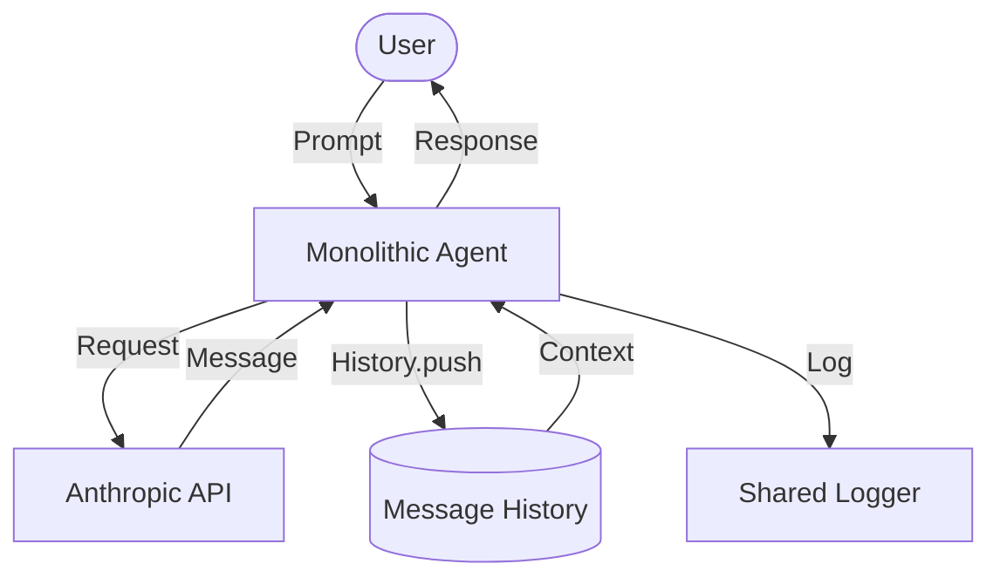

# Chapter 1: The Inception

This chapter marks the beginning of the journey, where we establish the fundamental communication loop between a human user and an AI model.

## The Goal
The objective was to create a basic CLI application that could maintain a stateful conversation with Claude. This required setting up a persistent history and a recurring interaction loop.

## Inception & Tooling
At this stage, we deliberately chose a set of low-level but powerful libraries to build our foundation:

- **Commander**: Used to provide a professional CLI experience with flag support (e.g., `--verbose`).
- **Readline**: Facilitated the interactive loop, allowing the agent to capture user prompts sequentially.
- **Anthropic SDK**: The heart of the implementation, managing the API calls to `claude-3-5-haiku-latest`.
- **Pino**: High-performance logging library for structured output.

## Architecture
The agent in this chapter is **monolithic**. Everything from input handling to API management resides within a single file. 

- **[index.ts](file:///Users/m.rathod/Documents/Projects/code-agent-ts/chapter1/index.ts)**: Contains the entire agent implementation.

### The Message Loop
1. **Prompt**: Wait for user input.
2. **Request**: Send the entire conversation history to Claude.
3. **Response**: Receive the model's message.
4. **Append**: Update the history with both the user's prompt and Claude's reply.
5. **Repeat**: Loop back to the prompt.

### Logging Pattern
We use a shared `logger.ts` utility based on `pino`. This allows us to separate user-facing output from internal debugging information. Internal events are logged using `logger.debug` when the `--verbose` flag is active, while user messages are handled via `logger.info`.

### Flow Diagram


## How to Run
```bash
bun run chapter1/index.ts --verbose
```
