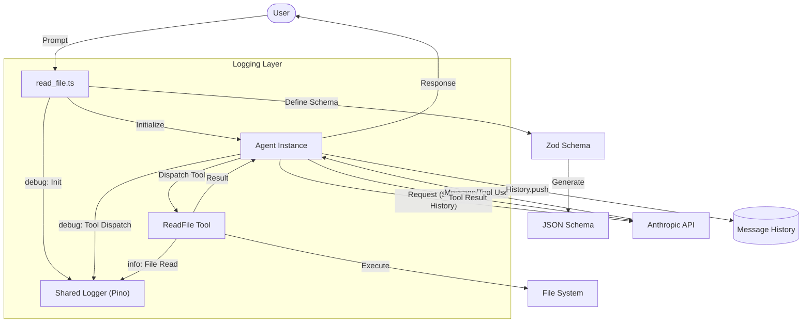

# Chapter 2: Introducing Tools

This chapter introduces the concept of **Tools** to the agent, enabling it to perform actions beyond simple conversation—starting with file reading capabilities.

## The Goal
In Chapter 1, the agent could only converse. Now we extend it with the ability to **use tools**. The focus here is on creating the first tool (`read_file`) and integrating it into the agent's reasoning loop.

## Architecture
The key file in this chapter is `tools/read_file.ts`, which demonstrates how to:
1. Define a tool with a Zod schema
2. Implement the tool's execution logic
3. Integrate the tool into the agent's conversation loop

- **[tools/read_file.ts](tools/read_file.ts)**: The first tool implementation with full agent integration.
- **[index.ts](index.ts)**: A basic agent without tools (for comparison with Chapter 1).

### Tool Definition Pattern
Tools in this framework follow a standard pattern:
1. **Zod Schema**: Define the input parameters with validation and descriptions.
2. **Execute Function**: Implement the actual tool logic returning a `Promise<string>`.
3. **ToolDefinition**: Combine the schema and executor into a single interface.

### The Tool Use Loop
When the API returns a `tool_use` block:
1. The agent dispatches to the matching tool
2. The tool executes and returns a result
3. The result is sent back to the API as a `tool_result`
4. The loop continues until no more tool calls are requested

### Flow Diagram


## How to Run
```bash
bun run chapter2/tools/read_file.ts --verbose
```
