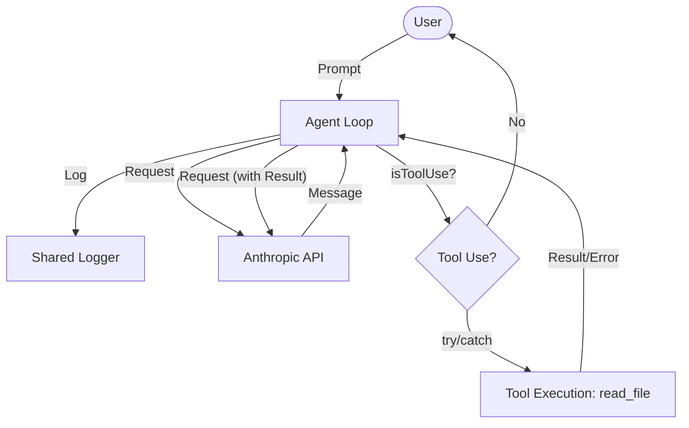

# Chapter 2: Empowerment through Tools

This chapter expands the agent's capabilities by moving from a simple chat interface to an "active" tool-using agent.

## The Goal
A chat agent is limited by its training data. To be useful in a development context, it needs the ability to observe the environment. The focus here was to implement **Tool Integration**, specifically allowing the agent to read files from the local filesystem.

## Evolution of the Loop
In this iteration, the agent's architecture begins to shift. We introduce a mechanism for the model to signal that it wants to perform an action.

- **[index.ts](file:///Users/m.rathod/Documents/Projects/code-agent-ts/chapter2/index.ts)**: The primary entry point. While similar to Chapter 1, it lays the groundwork for tool-aware prompting.
- **[tools/read.ts](file:///Users/m.rathod/Documents/Projects/code-agent-ts/chapter2/tools/read.ts)**: A self-contained execution script that demonstrates a specific tool implementation for reading files.

### Tool Definition & Schemas
We use **Zod** to define the expected input for each tool. This allows us to:
1. Validate the model's output before execution.
2. Automatically generate the JSON Schema that Claude needs to understand how to use the tool.

### Error Handling & Logging
This chapter adopts **idiomatic TypeScript error handling** using standard `try-catch` blocks. The agent is now resilient to filesystem errors (permissions, missing paths), which are reported back to the model as gracefully handled tool errors. 

Logging is centralized via the shared `logger.ts` (using `pino`), enabling cleaner separation between debug traces and user output.

### The read_file Capability
The first tool implemented was `read_file`. This involved:
- **Node.js `fs/promises` interaction**: Asynchronously reading file contents.
- **Tool Mapping**: A registry matching model requests to TypeScript functions.
- **Result Feedback**: Feeding file content or handled errors back into the conversation history.

## Lessons Learned
Clear error reporting and structured logging are vital. Centralized logging helps track the multi-turn tool execution flow without cluttering the main console output.

### Flow Diagram


## How to Run
```bash
bun run chapter2/tools/read.ts --verbose
```
