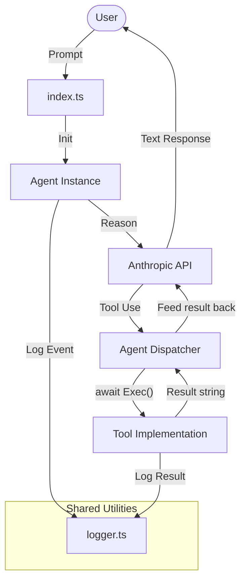

# Chapter 4: The Framework

This chapter represents the final, stable architecture of the project. It moves beyond simple scripts to a **Structured Framework** that prioritizes type safety, logging, and extensibility.

## The Goal
The final objective was to establish a pattern where adding new capabilities is as simple as defining a new tool file and registering it. 

## Mature Architecture
The project is now divided into clear layers:

### 1. The Core Agent
The `Agent` class is now completely tool-agnostic. It handles conversation state, inference, and tool dispatching.

- **[agent.ts](file:///Users/m.rathod/Documents/Projects/code-agent-ts/chapter4/agent.ts)**: A fully abstracted, tool-agnostic agent class.
- **[types.ts](file:///Users/m.rathod/Documents/Projects/code-agent-ts/chapter4/types.ts)**: Shared interfaces for tool definitions.
- **[index.ts](file:///Users/m.rathod/Documents/Projects/code-agent-ts/chapter4/index.ts)**: The clean entry point that wires the agent, tools, and shared logger together.
- **[tools/](file:///Users/m.rathod/Documents/Projects/code-agent-ts/chapter4/tools/)**: Normalized tool implementations (`read_file.ts` and `list_files.ts`).

### 2. Standardization (`types.ts`)
Shared interfaces ensure that all tools and the agent speak the same language. This eliminates runtime errors caused by mismatched tool signatures.

### 3. Integrated Logging (`logger.ts`)
The framework now utilizes a shared logging utility powered by `pino` and `pino-pretty`. This provides structured, high-performance logging with:
- **Level-based Filtering**: Controlled by the `LOG_LEVEL` environment variable or the `--verbose` CLI flag.
- **Pretty-printing**: Human-readable, colored output in development.
- **Structured Data**: Ability to log objects alongside messages for better debugging.

## Extending the Framework
To add a new tool to this framework:
1. **Define**: Create a tool file in the `tools/` directory.
2. **Implement**: Write the function returning a `Promise<string>`.
3. **Describe**: Create a `ToolDefinition` that uses Zod to define the input schema.
4. **Register**: Import and add the tool to the `tools` array in `index.ts`.

### Flow Diagram


## How to Run
```bash
# Standard run
bun run chapter4/index.ts

# Verbose run (debug logs enabled)
bun run chapter4/index.ts --verbose
```
